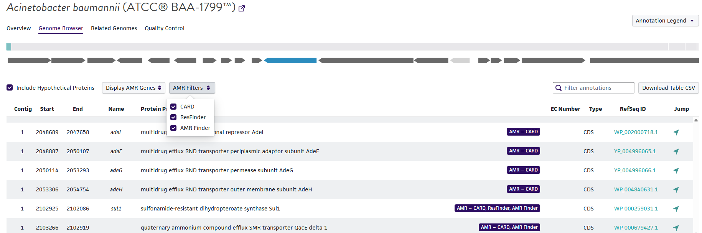

# AGP Resistome Analysis

The ATCC® Genome Portal (AGP) resistome packages serve as a way for ATCC to characterize and provide both integrated and standalone antimicrobial resistance (AMR) analysis for ATCC®'s authenticated bacterial reference genomes. The resistome dataset packages and integrated GenBank reporting combine multiple AMR detection tools with standard structural annotations to deliver transparent, reproducible, and analysis-ready resistome results.

Resistome annotations are collated into downloadable outputs for ATCC® customers and also displayed directly within the AGP Genome Browser for easy parsability and website-wide searches.

---
## Overview

During bacterial genome annotation using NCBI's Prokaryotic Genome Assembly Pipeline (PGAP), ATCC®'s Sequencing & Bioinformatics Center applies an additional layer of *in silico* antimicrobial resistance detection using three tools:

- [AMRFinderPlus](https://pubmed.ncbi.nlm.nih.gov/34135355/)
- [CARD RGI (Resistance Gene Identifier)](https://pubmed.ncbi.nlm.nih.gov/36263822/)
- [ResFinder](https://pmc.ncbi.nlm.nih.gov/articles/PMC8914360/)

These tools collectively identify acquired AMR genes, resistance-associated mutations, and selected efflux or overexpression mechanisms. Results from all tools are collated and contextualized relative to standard PGAP annotations to support downstream interpretation and validation.

---

## AMR Detection Tools

### AMRFinderPlus (NCBI)

AMRFinderPlus identifies antimicrobial resistance genes and resistance-conferring mutations using protein homology searches. The workflow employs:

- Hidden Markov Models (HMMs)
- BLASTP/BLASTX searches
- A curated NCBI reference database of AMR genes and proteins
- Heirachical tree of gene families

AMRFinderPlus detects acquired resistance genes, specific mutations conferring organism-specific resistance, and selected stress-response and efflux-related mechanisms.

> ATCC runs AMRFinderPlus in both protein AND DNA sequence as input, for the maximum prediction strength. The `--organism` field is also populated when possible, to allow for point mutations being reported. 

### CARD RGI

CARD RGI (Resistance Gene Identifier - McMaster University) detects resistance determinants using the Comprehensive Antibiotic Resistance Database (CARD). Detection methods include:

- BLAST-based similarity search
- HMM-based protein and mutation models
- rRNA mutation detection models

CARD supports identification of resistance genes, protein homologs, and curated resistance-associated variants.

> ATCC runs RGI/CARD software (McMaster University) on the PGAP-predicted CDS nucleotide file as input, specifying the `contig` input type. The `--include_nudge` option is also utilized to retain those hits that were able to be nudged from loose to strict hits.

### ResFinder

ResFinder identifies acquired antimicrobial resistance genes at the nucleotide level using:

- k-mer alignment
- BLASTN-based searches

This approach is optimized for detection of horizontally acquired resistance genes directly from DNA sequence.

> ATCC runs RGI/CARD software (McMaster University) on the PGAP-predicted CDS nucleotide file as input. `--species` name is provided and the software is ran with both `--acquired` and `--point` mutations options enabled. `--min_cov_point` mutation is set to `0.6` and the PointFinder thresholde, `--threshold_point`, is set to `0.8`

### PanISa (Pan‑Insertion Sequence Analyzer)

PanISa identifies insertion sequences (IS elements) using short-read alignments rather than reference databases. This method analyzes:

- Soft-clipped reads
- Flanking direct repeats

PanISa reconstructs insertion site elements directly from sequencing evidence, supporting detection of mobile genetic elements linked to resistance mechanisms.

> ATCC runs panISa using the authenticated and iso-generated Illumina short-read files, mapped back to the final genome assembly, as input. 

---

## Output Packages

### Excel Workbook

Each resistome analysis produces an Excel workbook containing multiple sheets, each representing a distinct analytical layer:

- **Collated AMR Hits**  
  Integrated AMR results mapped to PGAP annotations

- **AMRFinder**  
  Raw AMRFinderPlus output

- **CARD**  
  Raw CARD RGI output

- **ResFinder**  
  Raw ResFinder output

- **PGAP Annotations**  
  Standard structural and functional genome annotations

- **WARNING-FULL**  
  A fully merged table containing all PGAP and AMR-related columns for complete transparency

- **PanISa**  
  Insertion sequence analysis output

### JSON Metadata

A companion JSON file is provided with each resistome package. This file includes:

- Tool versions
  - PGAP build
  - AMRFinderPlus software & database
  - ResFinder software
  - RGI software
  - CARD database version
- Catalog metadata
  - ATCC catalog number
  - Curated taxonomic name
  - ATCC vial batch number
- Genome identifiers
  - Assembly ID hexadecimal
  - Genome ID hexadecimal

The JSON output is structured for programmatic access and downstream automation.

---

## Integration with GenBank Records

To preserve provenance and ensure long-term interpretability, AMR evidence is added directly to GenBank files using structured inference qualifiers.

Annotations are applied to existing CDS or gene features when possible. If no suitable feature exists, new gene features may be created using genomic coordinates derived from AMRFinder outputs.

Inference qualifiers follow the format:

`/inference="profile:<TOOL_NAME>:"`

This approach embeds AMR detection evidence directly into the GenBank record while retaining compatibility with downstream tools and validators.

---

## Visualization on the ATCC Genome Portal Genome Browser

For bacterial genomes with detected AMR markers, annotated resistance genes are displayed in the AGP Genome Browser as an infographic and hoverable tag, which denotes `AMR -` followed by detection in each of the possible databases. For example, detection by all three methodologies and databases would appear on a gene window such as:

>AMR - CARD, ResFinder, AMR Finder

These genes can be auto-selected for by enabling the following dropdown `Display AMR Genes`.
This then enables another toggleable dropdown `AMR Filters`, which allows for futher selction based on the gene's inclusion in each tool. 

This enables users to inspect resistance loci in genomic context alongside standard annotations.

---

## Intended Use

The AGP resistome packages are intended for:

- Microbial genomics research
- Antimicrobial resistance surveillance
- Bioinformatics pipeline development
- Downstream comparative and functional analyses

## Data Use Agreement

Please read the following End-User Agreement. Users acklowledged this agreement on first download of data from the ATCC Genome Portal, and the resistome packages and datatypes are included in this agreement as well.

[Data Use Agreement](https://www.atcc.org/policies/product-use-policies/data-use-agreement)

---

## Citation

Usage of AGP resistome data is subject to ATCC data use and access policies. If used in publications, please cite the ATCC Genome Portal and the underlying AMR tools as appropriate.

ATCC Genome Portal
> Benton B, King S, Greenfield SR, et al. The ATCC Genome Portal: Microbial Genome Reference Standards with Data Provenance. Thrash JC, ed. Microbiol Resour Announc. 2021;10(47):e00818-21. https://journals.asm.org/doi/10.1128/MRA.00818-21

AMRFinderPlus
> Feldgarden M, et al. AMRFinderPlus and the Reference Gene Catalog facilitate examination of the genomic links among antimicrobial resistance, stress response, and virulence. Sci Rep 11(1): 12728, 2021.

CARD/RGI
>Alcock BP, et al. CARD 2020: antibiotic resistome surveillance with the comprehensive antibiotic resistance database. Nucleic Acids Res 48(D1): D517-D525, 2020.

ResFinder
>Florensa AF, et al. ResFinder - an open online resource for identification of antimicrobial resistance genes in next-generation sequencing data and prediction of phenotypes from genotypes. Microb Genom 8(1): 000748, 2022.

PanISa
>Treepong P, et al. PanISa: An R Package for Ab Initio Detection of Insertion Sequences from Short-Read Sequencing Data. Bioinformatics 35(2): 310–312, 2018.